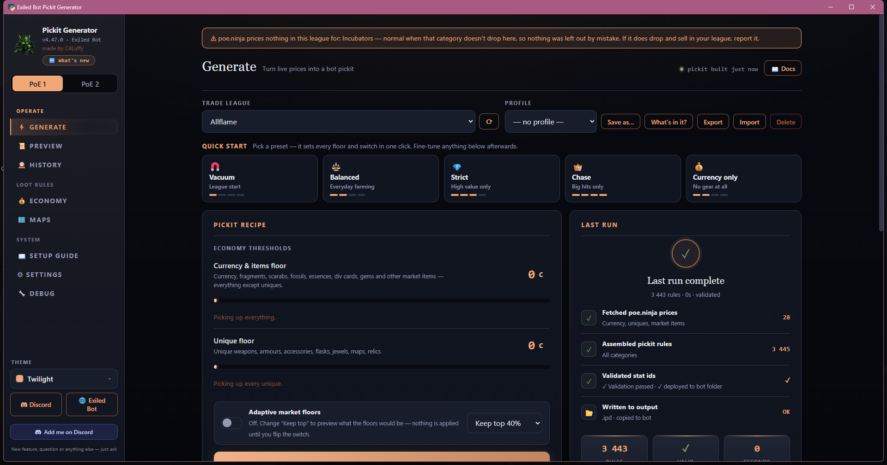

<p align="center">
  
</p>

<h1 align="center">Exiled Bot Pickit Generator</h1>

<p align="center">
  <strong>Build a pickit you can understand.</strong><br>
  Turn live poe.ninja prices—<strong>Path of Exile 1 or 2</strong>—into a validated Exiled Bot pickit, or translate an existing <code>.ipd</code> into an in-game loot filter with every unavoidable difference reported.
</p>

<p align="center">
  <a href="https://github.com/c4Luffy/exiled-bot-pickit-generator/releases/download/v4.51.0/ExileBot2PickitGenerator.exe"></a>
  <a href="https://github.com/c4Luffy/exiled-bot-pickit-generator/releases"></a>
</p>

<p align="center">
  Portable <code>.exe</code> · No installer · No Python · No game-account access
</p>

<p align="center">
  <a href="https://c4luffy.github.io/exiled-bot-pickit-generator/">Website</a> ·
  <a href="https://github.com/c4Luffy/exiled-bot-pickit-generator/releases/tag/v4.51.0">Release notes</a> ·
  <a href="CHANGELOG.md">Changelog</a> ·
  <a href="https://discord.gg/T7DU3Afve6">Discord</a> ·
  <a href="https://github.com/c4Luffy/exiled-bot-pickit-generator/issues">Issues</a>
</p>



<p align="center"><sub>Real running-app capture · Path of Exile 1 · Generate · captured on v4.47.0 · <a href="https://c4luffy.github.io/exiled-bot-pickit-generator/#top">see all 22 tabs of both games</a></sub></p>

## Start here

There are two simple ways to use the app.

### I need a pickit

Choose your league and a loot preset, adjust the price floors you want, then select **Generate**. The app fetches current poe.ninja prices, writes and validates the `.ipd`, and checks that Exiled Bot is reading the same profile.

**Choose a league → Pick a preset → Set your floors → Generate**

### I already have a pickit

Drop any Exiled Bot `.ipd` into the window—a hand-made file, a friend's pickit, or one created by another tool. The app reads it, explains what the game can represent, and saves a translated Path of Exile loot filter.

**Drop the `.ipd` → Review the report → Save the `.filter`**

## Generate in four steps

1. **Pick your league.** Fetch current Path of Exile prices from poe.ninja.
2. **Choose a preset.** Start with Vacuum, Balanced, Strict, Chase, or Currency only.
3. **Set your floors.** Adjust what is worth stopping for, or use Auto-floor.
4. **Generate and check.** Write the files, validate thousands of rules, and confirm the active profile.

## Create your filter

**Create your filter** reads any Exiled Bot pickit and translates its rules into an in-game loot filter. When Path of Exile's filter language cannot represent a bot-only condition, the conversion report says exactly what happened.

- **Converted:** represented directly in the game filter.
- **Shown wider:** a bot-only check was removed, so the item remains visible.
- **Untranslatable:** listed with its source line and the reason.

Your source `.ipd` is **read-only**, is never modified, and is never uploaded. If it changes after the filter was created, the app warns you.

> [!WARNING]
> **Hide everything else starts OFF, and remembers your choice.** Gold is never hidden. Leave it **off while botting** — hidden ground labels can stall pickup. Always review any translation warning before turning it on.

## Item Check

Hover an item in Path of Exile, press `Ctrl+C`, then paste it into **Item Check**.

You receive one of three verdicts:

- **Picked up**
- **Ignored**
- **Depends on the rolls**

Each verdict includes the deciding rule and a practical next step.

> [!NOTE]
> **The verdict is not a simulation.** Item Check runs the same generator that writes the `.ipd` and shows the actual emitted line. With the same current settings, Item Check and the generated pickit cannot disagree.

Rare gear stays honest. If no recipe covers the base or its slot is disabled, the answer is a definitive no. When a recipe does cover it, Item Check shows the scored stats and threshold because the final roll check happens inside Exiled Bot. Fractured items show the actual target mods.

## Know which file does what

| Output | Used by | What it controls | Important note |
| --- | --- | --- | --- |
| `.ipd` pickit | Exiled Bot | Which items the generated pickit targets | `pickit.ini` must point to the generated filename |
| `.filter` loot filter | Path of Exile | Which ground labels are visible and how they look | Select it again under **Options → Game → Filters** after every save or regeneration |
| On-screen conversion report | You | What converted, was shown wider, or could not translate | It is a report, not a third output file |

<details>
<summary><strong>See a generated rule sample</strong></summary>

```text
// pickit — generated from live poe.ninja prices
[Type] == "Divine Orb" # [StashItem] == "true"
[Type] == "Stellar Amulet" && [Rarity] == "Normal" && [ItemLevel] >= "82" # [StashItem] == "true"
[Type] == "Heavy Belt" && [Rarity] == "Unique" # [UniqueName] == "Headhunter" && [StashItem] == "true"
[Category] == "Waystone" && [WaystoneTier] >= "10" # [StashItem] == "true"
```

</details>

## Safe, local, and recoverable

- Imported pickits are never modified or uploaded.
- Generated output stays on your PC.
- Rotating backups protect output before replacement.
- Hand-made ANSI pickits decode correctly.
- Unusual item-name characters are excluded and reported instead of disappearing silently.
- The app never asks for your Path of Exile account.

Windows SmartScreen may ask for confirmation because this free community executable is not code-signed. You can verify the release with its [published SHA-256 checksum](https://github.com/c4Luffy/exiled-bot-pickit-generator/releases/download/v4.51.0/SHA256SUMS.txt).

### Three important usage notes

1. **Check `active_profile`.** A mismatch can make Exiled Bot read an older pickit. The connection check verifies it.
2. **Reselect the optional game filter after every save or regeneration.** Choose it again under **Options → Game → Filters**. Exiled Bot reads the `.ipd`, not the `.filter`.
3. **Turn Hide everything else off while botting.** Hidden ground labels can stall pickup.

## Current release: v4.51.0

### Gems priced as they drop, and a pill that stops lying

- **Skill gems were priced at their best variant, not what drops.** poe.ninja lists a gem once per level/quality/corrupted combination, dearest first, and we kept the first row — so Frostblink was written as `7853.00` (a level-20 quality-20 **corrupted** one) when the gem that falls on the ground is worth 1. **666 of 810 gems** were overstated by 10x or more; Heavy Strike of Trarthus, 2c on the ground, was written as 36,810c.
- **That made your floor useless for gems** — every gem cleared any floor on the strength of a variant it will never be, so the bot took all 810. They are now priced from the row a dropped gem matches, best roll still noted. At a 20 ex floor: **68 gems, not 810**.
- **The Economy "keep" pill described the wrong thing.** It showed only whether you had manually excluded an item, never whether it clears your floor — so a 4 ex tablet sat there in green saying "keep" while the generator wrote it commented out. Those rows now read **under floor**, with a tooltip explaining why and how to include them.
- **The bot-activity list got item art, prices and a haul total**, and the chance outcome list now labels the unique you are chancing *for*.

### v4.48.5 — Skeleton loading, real empty states, and stat tiles that count up

- **Tables that are still loading show their shape instead of nothing.** Economy filled ~100 rows in one go, reflowing the page under your cursor; the two Maps tables just read `Loading…`. They draw skeleton rows now, so nothing jumps when the data lands. A *refresh* keeps the existing rows — swapping a readable table for grey bars is a downgrade — and a **failed** load clears the skeleton, names the error and offers Retry. A test enforces that last part: a skeleton that outlives its request is the old "Loading prices…" hang wearing a nicer coat.
- **History has a real empty state.** `No runs yet.` in a bare table cell became an explanation of what the tab records, plus the button that gets you there.
- **The stat tiles count up** instead of snapping from `–` to `2,214`. Respects `prefers-reduced-motion`, keeps thousands grouping, and animates only the seven tiles holding real numbers — file size and validation are left alone.

### v4.48.4 — Polish: the keyboard, and affordances that lied

A sweep over every tab. Everything here is additive — nothing moves or resizes, so no layout shifts.

- **You can see where the keyboard is.** Text boxes got a gold border on focus; buttons, selects and links got nothing, and three rules explicitly set `outline:none` — so tabbing through the app was a guess. Everything focusable now draws a ring, via `:focus-visible` so mouse clicks look exactly as before.
- **The tab rail answers the keyboard.** It was a column of plain `<div>`s — not focusable at all, so the only route in was `Ctrl+1..0`, which reaches ten of sixteen tabs. Tab and Enter work now, and the active tab carries `aria-current`.
- **Sixteen of nineteen table headers stopped pretending to be clickable.** Only the three Economy columns sort, but every header showed a hand cursor and lit up on hover.
- **Selected text uses the app's colour**, not the browser's default blue; **`prefers-reduced-motion` is honoured**; and **setting the bot's switches now asks first**, since it writes into your bot install.

### v4.48.3 — Quality of life: the bot's switches, and the keyboard

- **The Maps page can set the bot's two switches for you.** It already read `map_profile` and `enable_map_tier_upgrading` and told you what to change — which still left you hand-editing an INI inside your bot install to finish a job this app started. A **Set these for me** button now does it, shown only when something is actually wrong. It is someone else's config file, so: the original is backed up, the file is rewritten byte-for-byte apart from those two keys (comments, ordering, unknown sections and non-UTF-8 bytes all survive), a missing key is created under its real section, and the write is atomic.
- **`Ctrl+R` refreshes the league list, as the button has always claimed.** Nothing implemented it, so the key fell through to WebView2 and reloaded the whole app — losing your run summary and dropping you back on Generate.
- **Escape clears the search box you're typing in**, and an "all shortcuts" link beside Generate lists the rest — only `Ctrl+G` was shown anywhere before.
- **The Maps page stopped calling the map runner "not written by this app"** — it has written it since v4.47.1.

### v4.48.2 — The 7-day column shows the seven-day change

- **"7d Δ" was showing something other than what it says.** The column's tooltip reads *"7-day trend and total change (poe.ninja)"*, but for currency, fragments, scarabs and every other exchange category it showed the change since **your last generate** — so right after a run the whole table read a flat `0%` and looked broken. poe.ninja sends the real seven-day figure for those rows too, under a lowercase `sparkline` key (uniques use `sparkLine`); it was never read. 91 of 100 currency rows now carry a genuine move, checked line-for-line against the raw API.
- **The map-runner's backups rotate.** Every PoE 1 run copied the previous runner file into `backups/` and never pruned it, so the folder grew by one file per run. It now honours your backup count, anchored to its own filenames so it can never touch a pickit backup.
- **A test rejects invisible control characters in source.** The one corruption every other gate misses: ruff parses it, `node --check` parses it, grep prints the line as if it were fine, and the editor shows nothing.

<details>
<summary><strong>Older releases</strong></summary>

### v4.48.1 — No "less than" on [MapTier], and the bot's own priority rules

- **A tier block no longer uses `<=` on `[MapTier]`.** The map runner's own docs warn that "less than" on `[MapTier]` hits a bot bug unless paired with a large `>=`. Selecting T11–T13 wrote exactly that shape; it now writes one `==` per tier, keeping the open-ended `>=` for a run reaching the top.
- **The generated runner carries the bot's priority list** (`[UpgradeMapTier] >> [IgnoreMap] >> [UpgradeToRare] >> [UpgradeToMagic] >> [RunMap]`) and its two gotchas — upgrading only happens to a map the bot has selected to farm, and marking a map for both upgrading *and* running means it gets run.
- **The optional levers are written out, commented**: `[UpgradeToRare]` (which outranks `[UpgradeToMagic]`) and `[UpgradeQuality]`.

### v4.48.0 — Map tier upgrading, and the bot's own switches checked

- **The map runner upgrades the tiers you don't run.** Every tier below your selection gets an `[UpgradeMapTier]` rule, so low maps are traded up toward the ones you farm. Exiled Bot ships ~20 upgrade examples, but each is commented out *and* names a pre-3.28 base (`Arena Map`, …) that no longer exists — so they'd match nothing even uncommented. Ours name the current `Map (Tier N)` base.
- **The Maps page checks the bot's own settings.** The bot picks its map file by `map_profile` in `config.ini`, and upgrading needs `enable_map_tier_upgrading=true` (it ships `false`). Both are read from your install and shown with a tick or a warning and the exact value to set — so a correctly generated file can't sit there unread.

### v4.47.3 — Click anywhere on an Economy row again

- **A click anywhere on a row turns that rule on or off, in both games.** It used to, then it was narrowed to the keep/skip pill because clicking was *also* how you pinned the detail card — so people turned rules off by accident while trying to read one. Now the card is docked and hovering shows everything, so the click has nothing else to do. The copy button and the pill keep their own behaviour, and right-click still copies the rule.

### v4.47.2 — The Economy detail card stops covering the table

- **The hover card has its own column now.** It was pinned to the cursor, so by construction it sat on top of the rows you were reading — v4.41.29 capped its right edge to keep the keep/copy buttons clickable, but rows above and below were still hidden. It now sits in a sticky column beside the table: never moves, never covers a row, and stays readable while the mouse is elsewhere. Narrow windows fall back to the floating card.

### v4.47.1 — The bot's map runner is generated too

- **Every Path of Exile 1 run now writes the map-runner config as well.** `<output>_maps.ipd` — the file deciding which maps the bot **runs**, rerolls or skips — is written beside the pickit and copied into the bot's `Maps` folder. It follows Exiled Bot's own `Maps/default.ipd` rule for rule: upgrade normal/magic maps, run the tiers you picked, skip uniques, reroll reflect and no-regen mods on magic maps and skip those maps when they're rare.
- **Your bot's own `default.ipd` is never overwritten** — the app writes its own profile file, so set `map_profile` in the bot's `config.ini` to the new name to use it. The run log says so when it still points elsewhere.
- **The last PoE 1 loot-filter traces are gone** — the `.filter` button on Generate and the run line that promised a file PoE 1 never writes.

### v4.47.0 — Path of Exile 1 map pickup actually works

- **The map rules v4.45/v4.46 generated matched nothing.** Since 3.28's Atlas rework every ordinary map of a tier shares one base, literally named `Map (Tier N)`, and **Exiled Bot v0.102 doesn't resolve `[MapTier]` on those bases** — so the `[Category] == "Map" && [MapTier]` rule could never match a map. The pickit now names the base directly (`[Type] == "Map (Tier 16)"`), which is exactly what the bot's own `default.ipd` does and documents. **Regenerate any PoE 1 pickit built on 4.45 or 4.46.**
- **Path of Exile 1 drops the loot-filter features.** PoE 1 writes only the pickit, so "Create your filter" and Settings → In-game filter are hidden there rather than explaining why they do nothing.
- **Switching games no longer shows the other game's run.** The Generate page kept the previous game's rule counts and validation state, so flipping to PoE 1 displayed PoE 2's numbers for a pickit it never built.

### v4.46.0 — Pick any map tiers, and the wizard covers both games

- **`[MapTier]` was reported as an invalid mod.** The validator's list of pickit *keys* was PoE 2-only (it had `WaystoneTier` but not PoE 1's `MapTier`), so every map rule v4.45.0 generated came back as a validation **error** on a correct file. Fixed, along with the rest of Exiled Bot 1's key vocabulary.
- **Map tiers are a multi-select.** It was one "this tier and up" floor, so "T16 and T14, nothing in between" was impossible. Pick any set — neighbouring tiers collapse into one rule, gaps become separate rules — with quick presets that just set a selection. A run reaching the top stays open-ended (`>= 16`, not `== 16`) because conqueror and boss maps drop T14–18.
- **The first-run wizard asks which game.** It only ever set up whichever game was active (PoE 2 on a fresh install), so a Path of Exile 1 player was never guided.

### v4.45.1 — The .exe finally says which version it is

- **A downloaded update looked identical to the copy it replaced.** The exe's filename is deliberately constant, so Windows' version *resource* is the only thing telling two builds apart — and it was never written, leaving Properties → Details blank on every release ever shipped. It's now generated from `version.py` at build time.

### v4.45.0 — Path of Exile 1 maps, and a whole category that was missing

- **Maps are generated for Path of Exile 1**, on their own page under Economy. PoE1 has ~120 map bases and poe.ninja prices most of them as `Drox Map (Tier 16)` — a price for *any* tier-16 map with that influence, not an item you can name. So you pick a tier and the pickit gets one `[Category] == "Map" && [MapTier] >= "N"` rule (what Exiled Bot's own default pickit does), the other tiers written out commented, plus a `[Type]` rule for every map priced under a real base name.
- **The page shows the real output**, rendered by the same builder that writes the file — with tier cards, a what-to-keep / what-to-skip guide, today's named-map values, and your bot's own map-runner folder (which this app never writes).
- **Runegrafts were never fetched.** 30 price in the current league, all with live trade volume and worth 5c+ — the top three between 450 and 700 chaos — and none had a rule at any floor. The same miss as Verisium.

### v4.44.0 — Both games are officially done 🎉

**Path of Exile 1 and Path of Exile 2 both run end to end.** Every tab of both games was checked in the running app — **14 in PoE 2, 8 in PoE 1** — each fetching live poe.ninja prices and writing a validated pickit Exiled Bot reads. Nothing is half-built, and there is no known issue open against either game. Dual-game support landed in v4.42.0 and took five releases to finish; this is the line under it.

**From here the work is bug hunting and new features.** Hit something? [Say so on Discord](https://discord.gg/T7DU3Afve6) and it gets fixed.

### v4.43.0 — Every tab of both games, and an empty category stops crying wolf

- **The website now shows a real capture of all 22 tabs — 14 in Path of Exile 2, 8 in Path of Exile 1 —**
  behind a PoE 1 / PoE 2 switch on the screenshot frame. Before this, three of the fourteen frames were
  Path of Exile 1 captures sitting in a Path of Exile 2 tour, all labelled with a version none of them
  were taken on.
- **An empty price category no longer tells you it was renamed.** poe.ninja prices no Incubators in some
  Path of Exile 1 leagues, and the banner said the category "may have been renamed and stopped pricing —
  please report it". The type is fine (29 items price in Standard) and simply doesn't drop there. A
  renamed type returns a 404 and is already reported as a failed fetch, so an empty-but-valid payload
  never meant a rename. It now says the league prices none of them, and to report it only if they sell there.
- **The release tool now points the website at the release it just cut** — nothing did, so the landing page
  advertised v4.42.0, and every Download button on it served that build, while v4.42.4 was out.

### v4.42.0–v4.42.4 — Path of Exile 1 support: one app for both games

- **A PoE 1 / PoE 2 switch at the top of the sidebar turns this into one app for both games.** Pick PoE 1 and it prices Path of Exile 1 live from poe.ninja — currency, fragments, scarabs, fossils, essences, divination cards, uniques and the rest — and writes a pickit in **Exiled Bot's native PoE1 format**: uniques by `[UniqueName]`, everything else by `[Type]`, verified against a real Exiled Bot install's own generated pickit.
- **Each game keeps its own everything.** League, value floors, output file (`poe1_pickit.ipd` vs `poe2_pickit.ipd`), run history and profiles are stored per game, so switching never overwrites the other.
- **PoE 1 is economy-only** — no rare-gear / craft / chance / fracture pages — prices in **Chaos**, defaults to a league that poe.ninja actually prices, and has its own setup guide.
- **Renamed** to *Exiled Bot Pickit Generator* now that it serves both games. The `.exe` filename is unchanged, so the in-app updater keeps working across the rename.
- **Then four polish passes (v4.42.1–v4.42.4).** Every priced rule's comment now shows Chaos *and* Divine — `// ExValue = 23.88 c · 0.03 div` in PoE 1, `// ExValue = 23.88 ex · 5.4 c · 0.03 div` in PoE 2 — with the bare number still first so the loot filter reads it unchanged. Copy-rule, the Economy hover card and Preview all show the real PoE 1 `[UniqueName]` rule instead of the PoE 2 form, the number-key shortcuts match the sidebar PoE 1 actually shows, and History and profile floors read in Chaos.

### v4.41.29 — The Economy hover card stops covering a row's keep/copy buttons

- **The detail card that pops up when you hover an Economy row could sit on top of the keep/skip and copy buttons, so you couldn't click them.** It followed the cursor toward the right edge of the table and overlapped the whole action column — worse on a high-DPI or scaled display, where it covered several rows' buttons at once. The card now caps its right edge at the left edge of that action column, so it never overlaps the keep/copy buttons; it still appears beside the cursor as before, hovered or pinned.

### v4.41.28 — Every rule builder now escapes quotes in item names

- **A unique whose name or base type contained a literal `"` would have corrupted its pickit rule.** `build_unique_lines` interpolated the poe.ninja `name` and `baseType` straight into the rule with no escaping — the one builder the v4.41.18 audit fixed for `force_names` but left with raw quoting, and that release admitted quote escaping was "still incomplete elsewhere." A quote in either value would unbalance the rule and Exiled Bot's validator would reject the whole file. Both now go through `_quote_ipd`, matching every other builder. The uncut-gem builder (external names, but regex-gated so a quote can't reach it) is wrapped too, so "every builder escapes external names" is now literally true. No live item has a quote today; this closes the latent case.
- **Regression test added**: a unique whose name and base both contain `"` still produces a rule whose structural quotes stay balanced.

### v4.41.27 — Scheduled and piped runs stop crashing on a non-UTF-8 console

- **A headless `--cli` / `--regenerate` run aborted before writing a single file on a console that wasn't UTF-8.** Both modes print progress with `✓` and `·`, and on a Windows console that isn't UTF-8 — cp1252, which is exactly what Task Scheduler and a redirected pipe (`> log.txt`) hand you — the *first* ticked category raised `UnicodeEncodeError` and killed the run before any output was generated. `--regenerate` is documented for Task Scheduler, so its intended home was the one that broke it.
- Both entry points now wrap `stdout`/`stderr` as UTF-8 with `errors="replace"` (the same wrapper `tools/check_game_data.py` already uses), so an exotic console degrades a glyph instead of aborting the run. Only a stream that isn't already UTF-8 is touched, so a normal terminal is unaffected.

### v4.41.26 — Concurrent writes stop failing, plus a pass of visual polish

- **Two runs writing the same output collided and the write failed.** Every generated file — the `.ipd`, the `.filter`, the item report and the bot's own `pickit.ini` — used a temp file named after its target, so two runs writing the same output shared one temp name. That's an ordinary overlap here, because the app ships `--regenerate` for Task Scheduler: the GUI generating while the timer fires. **Reproduced** with two writers on one path — the old code raised a Windows `PermissionError`, so the write simply failed. Each write now gets its own uniquely named temp file (the protection `config.json` already had), and the same test passes with no errors and nothing left behind.
- **Visual polish, no layout changes.** KPI tiles on Preview, History and Debug gain a hairline accent, a little depth and a lift on hover, so a row of numbers reads as one panel. Section headings inside cards gain a small accent bar, making long pages easier to scan. All driven by the theme's own accent colour, so every theme keeps its voice.
- **The sidebar fits again.** Trimming 3px of padding per nav button reclaimed **~104px** — enough that the theme picker and the Discord / Exiled Bot links no longer fall off shorter windows.
- Considered and **rejected**: zebra striping on the Economy and History tables — both interleave hidden rows, so the banding would have striped rows you never see.

### v4.41.25 — The Exceptional tab explains its own exceptions

- **Belts and quivers looked like they didn't belong.** That tab is explained entirely by the extra rune socket an exceptional base rolls — 3 sockets for body armour and two-handers, 2 for gloves, boots, shields, foci and one-handers. Belts and quivers take **no runes at all**, so seven bases sat in a list whose stated premise didn't apply to them, with nothing saying why.
- They're listed because they're still the **strongest base of their slot to craft on** — the tab's actual subject. The card now says so directly instead of leaving you to assume a mistake.
- Wording only: no base added, removed or re-gated, and no generated rule changes.

### v4.41.24 — A gate you couldn't lower, and two more counts that lied

- **Create your filter reported "11 disabled rules" for a pickit with nothing disabled.** All eleven were the embedded syntax guide's own documentation — its `// Example:` lines and its Special Flags legend — which are comments carrying a real action token, so the counter read them as rules you had switched off. This is the **fourth** place the guide added in v4.41.18 produced a wrong number. The exclusion is narrow: a genuinely commented-out rule still counts, including one using `[Salvage]`/`[StashUnid]` or written without the `#` split. Verified both ways — the real pickit now reports **0**, and three deliberately disabled rules still report **3**.
- **The Craft tab couldn't lower the item-level gate on three jewellery bases.** Solar Amulet, Gold Amulet and Gold Ring had no data row, so the stepper's minimum fell back to a hardcoded `75` — while the control promises to floor at "this base's own drop level". They drop from **30**, **35** and **40**, so everything below 75 was unreachable. Fixed from the game's own base-item table.
- **History under-reported past 30 runs.** The app keeps the last **50** and the tab says so, but only read back 30 — so "runs logged" stuck at 30 and **"peak rules" could miss a real peak** in the oldest 20 kept runs.
- Also checked and healthy: **Item Check** (Waystones, `Superior` bases and Uncut Gems all still answer correctly), **Fracture** (79 targets, 0 unverified stat ids), **Settings** and **Setup guide**.

### v4.41.23 — Two exceptional staff bases stop rendering blank

- **Sanctified Staff and Paralysing Staff showed as empty cards** on the Exceptional tab — an icon and a name and nothing else, while every other one of the 121 bases showed at least an item level.
- **Cause:** both joined the staff slot back in v4.39.1 (replacing two that never drop) but were never given a stats row, so the level fell back to `0` — which renders as nothing. It shipped that way for 13 releases.
- **Fix:** both now carry their real drop level (Sanctified **56**, Paralysing **52**), read from the game's own base-item table — the same authority the rest of the tab uses, and cross-checked against existing rows rather than guessed.
- Also checked the whole tab: the game-data drift checker reports **0 critical, 0 advisory**, and all 121 bases have artwork.

### v4.41.22 — Three UIs stop reporting skipped rules that were never skipped

- **Preview claimed "9 skipped" for a pickit with nothing disabled.** Those nine were the `// Example:` lines of the syntax guide that v4.41.18 began writing into every generated `.ipd` — they contain `[StashItem]` and start with `//`, so a bare substring test counted each as a rule you had switched off. The **"Skipped" filter** listed them as your disabled rules, and the rule total was inflated by nine.
- **The same miscount sat in three places.** It also fed the Generate tab's "skipped" tile and the `--cli` "Commented out:" total. All three now share one helper: a line counts as a rule only if it carries the `[StashItem]` action **and** the `#` identify split, and isn't a guide example.
- **The Chance tab shows the real outcome pool.** Each base lists every unique that shares it, dearest first, with live prices — so the tab's warning ("a Utility Belt is far more often an Ingenuity than a Mageblood") becomes visible data: Mageblood at ~328 div directly above the 5 ex and 1 ex outcomes. Built from data already fetched, so no extra network calls, and read-only so reading it can't toggle the base off.
- **Chance prices no longer flip units at random.** A ~46 ex unique rendered as a useless "0,1 div" while a 13 ex one correctly read "13,5 ex". Divine now appears only at 1 divine or more.
- **Pasted diagnostics are readable.** The report ended with 30 identical `INFO config saved` lines, pushing the one line that explained the problem off the end. Repeats collapse to `(x30)`, and any `ERROR`/`WARNING` survives even when older than the window.

### v4.41.21 — Prices load in the background, so the Economy tab opens instantly

- **The price fetch starts at launch instead of when you open Economy.** Opening the tab used to fetch 24 separate poe.ninja category price lists on the spot — five at a time, each with a back-off wait whenever poe.ninja rate-limited — and you watched "Loading prices…" while it finished. That same fetch now runs in the background shortly after the app opens, while you're still on Generate, so Economy is normally fully populated the moment you click it.
- **One fetch speeds up everything that reads prices.** They all share the same 15-minute cache, so **Generate**, the **Chance** tab and **Auto-floor** get the same head start — not just Economy.
- **Nothing else changes.** It's fire-and-forget: if the pre-fetch fails or you're offline, the tab loads exactly as before. Price freshness is unchanged, and **Refresh prices** still forces a live re-fetch. Tabs that never touched the network (Craft, Exceptional, Fracture, Magic & Rare, Preview, Item Check, History, Debug) were already instant.

### v4.41.20 — Economy tab overhaul: hover cards, value bars, collapsible groups

- **Hover cards on Economy rows.** Hover any item and a card shows its art, live price, 7-day trend, keep/skip status, and the exact pickit rule that catches it — so it's obvious at a glance what any row does. Unpinned, the card is a pass-through tooltip that never covers the row's own buttons; **click a row to pin it** into a stable panel with a Copy button and its own keep/skip toggle, closed by ✕, Esc, or a click away. It flips near the screen edges so it never spills off-screen.
- **Right-click a row to copy its pickit rule** instantly, without opening the card.
- **Value bars behind each price, log-scaled.** A faint fill reads as relative worth at a glance. Prices span huge magnitudes — a one-ex common versus a multi-thousand-ex chase item — so a linear fill flattened everything but the top few into identical slivers; the log scale spreads the low and mid range so every bar means something.
- **Collapsible Economy sidebar groups.** General, Equipment, Atlas and Always pick each fold with a click on their header, so the whole category list fits without scrolling. Headers are bigger and bold, with a caret and count.
- **No more accidental toggles.** Clicking a row no longer flips its keep/skip — only the keep/skip button does, so a stray click while reading the table can't silently drop a rule.
- **The Economy tab is faster.** The pickit-rule lookup behind hovers, right-click copy and the row Copy button is cached per item, so repeat interactions are instant instead of calling into the engine every time.
- **Generate is never silent.** A toast fires the moment a run starts and again when it finishes, with the rule count and time — whether you press Generate on the tab or via Ctrl+G.

### v4.41.19 — Tablets are priced live now, not hardcoded

- **Regular and unique tablets are no longer a hardcoded always-pick list.** poe.ninja added real pricing for both — Precursor Tablets (Overseer, Abyss, Breach, Ritual, Irradiated, Temple, Delirium; priced separately per rarity, Normal/Magic/Rare) and Unique Tablets (all nine) — so generated pickits now respect the normal value floor for tablets like every other market item, instead of force-picking every rarity regardless of what it's actually worth. Some are genuinely valuable — a Normal Ritual Tablet has been worth close to a Divine.
- **Both show up as their own Economy categories under Atlas**, matching how poe.ninja itself groups them, with live prices, 7-day trend arrows and per-item switches. Precursor Tablets are further grouped by tablet type, with each type's Normal/Magic/Rare rows kept together — the same idea as Exotic Bases grouping by gear slot.
- **The Economy sidebar now matches poe.ninja's own layout exactly** — section names, order, and item order within each section (General, Equipment, Atlas), checked directly against the live site. Waystones moved out of General into Always pick, since poe.ninja doesn't price it at all and every tier is always kept regardless of value.

Older releases than these are in the [changelog](CHANGELOG.md).

</details>

[Read the complete v4.51.0 release notes](https://github.com/c4Luffy/exiled-bot-pickit-generator/releases/tag/v4.51.0) · [full changelog](CHANGELOG.md)

<details>
<summary><strong>Everything included</strong></summary>

- Five presets: Vacuum, Balanced, Strict, Chase, and Currency only.
- Editable exalted-orb floors and Auto-floor.
- Current-league pricing and seven-day unique trends.
- Item Check with the actual emitted rule.
- Coverage for 17 rare-gear slots.
- Pickit-to-filter conversion with an honest report.
- Setup guide and connection check.
- Rotating backups and restore tools.
- Portable Windows application with no installer.

</details>

<details>
<summary><strong>Build from source</strong></summary>

Requirements: Windows 10 or 11 and Python 3.10 or newer.

```powershell
git clone https://github.com/c4Luffy/exiled-bot-pickit-generator.git
cd poe2-pickit-generator
python -m venv .venv
.venv\Scripts\Activate.ps1
python -m pip install -e .
python -m exilebot_pickit
```

</details>

## Help and community

- [Setup and troubleshooting](https://c4luffy.github.io/exiled-bot-pickit-generator/#faq)
- [Discord community](https://discord.gg/T7DU3Afve6)
- [Report an issue](https://github.com/c4Luffy/exiled-bot-pickit-generator/issues)
- [All releases](https://github.com/c4Luffy/exiled-bot-pickit-generator/releases)

---

Community project; not affiliated with Grinding Gear Games, Path of Exile 2, Exiled Bot 2, or poe.ninja.
